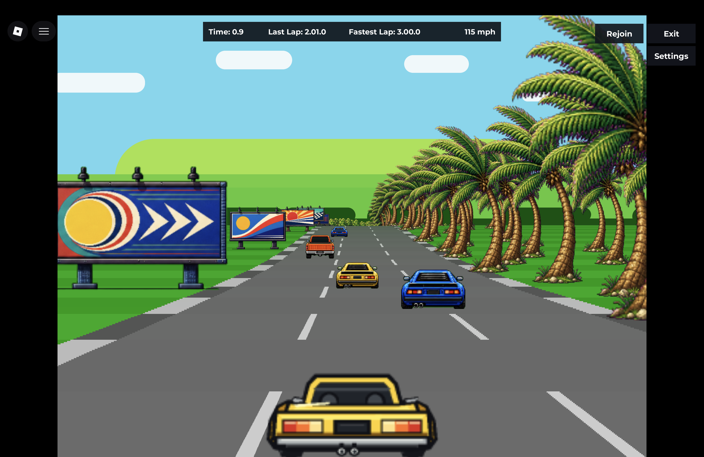
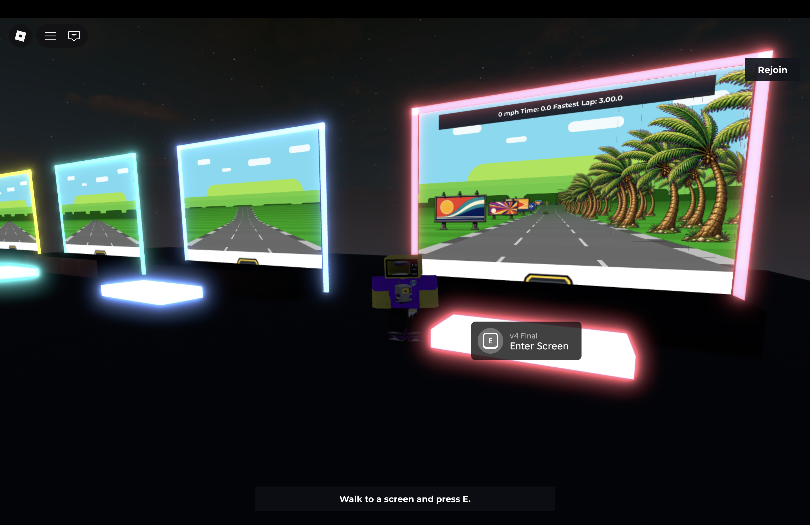

# Racer Lab

A Roblox/Luau port of [Jake Gordon's Javascript Racer](https://github.com/jakesgordon/javascript-racer), presented as a walkable lab containing every stage of the original tutorial and three extensions.



The first four screens preserve the original progression from a straight road to the complete pseudo-3D racer. The next three continue the same implementation with Roblox-specific controls, player presentation, and persistent records.



## Versions

| Screen | Lineage | Contents |
|---|---|---|
| `v1 Straight` | Upstream parity | Straight-road projection and driving |
| `v2 Curves` | Upstream parity | Curved road segments |
| `v3 Hills` | Upstream parity | Elevation and hills |
| `v4 Final` | Upstream parity | Traffic, roadside sprites, collisions, and lap timing |
| `v5 Mobile Controls` | Roblox extension | Touch controls and a mobile fullscreen layout |
| `v6 Driver Occupants` | Roblox extension | Driver and passenger presentation inside the player car |
| `v7 Record Boards` | Roblox extension | Personal, friends, and global fastest-lap boards |

## What the port adds

- Translates the browser canvas projection and simulation into Luau and Roblox UI objects.
- Places every version on a physical screen that players can enter or watch from the lab.
- Keeps active-player and spectator rendering synchronized through client/server state.
- Adds keyboard and touch input, DataStore-backed lap records, live boards, and debug overlays.
- Replaces the upstream media with project-specific texture atlases and a deterministic player-car art pipeline.
- Maps each published Roblox `PlaceVersion` back to the exact git commit and release artifact that produced it.

## Origin and licensing

The original source code is MIT-licensed, so the Roblox/Luau port and its code additions are also published under MIT with Jake Gordon's copyright notice preserved. The upstream media is a separate matter: its README says that the music was licensed only for the original project and that the placeholder sprites came from the Genesis version of OutRun.

This repository includes neither the upstream music nor the upstream sprite files. All graphics in this repository were created for Racer Lab and are released under the same MIT License.

- Source code, documentation, and project graphics: [MIT](LICENSE).
- Detailed provenance and upstream notices: [THIRD_PARTY.md](THIRD_PARTY.md).

This repository intentionally contains only the Racer Lab place. Lobby work,
archived proofs of concept, and other Roblox places should live in separate
repositories.

## Repository layout

- `racer.project.json` maps the Racer Lab place for Rojo.
- `src/racer` contains Racer Lab scripts.
- `src/shared/GeneratedPlaceIds.lua` contains non-secret place ids used by the
  optional in-game lobby return portal.
- `scripts/check-racer-parity.py` runs static parity checks for the racer model.
- `scripts/build-racer-release.sh` builds an exact release artifact from an
  immutable git snapshot with the pinned Rojo version.
- `scripts/publish-place.sh` builds and publishes Racer Lab through Roblox Open
  Cloud.
- `scripts/racer-publish-state.py` preserves the exact artifact and release
  identity across uncertain publish outcomes and owns the persistent release
  lock protocol.
- `scripts/test-release-snapshot-build.sh` verifies release-build determinism,
  worktree isolation, dirty-tree refusal, and the Rojo version pin.
- `scripts/test-release-lock.py` verifies lock contention, crash recovery,
  inode integrity, spoof refusal, and linked-worktree coordination.
- `scripts/test-publish-api-key-transport.py` verifies that the Open Cloud key
  crosses the authenticated self-exec only through its anonymous pipe.
- `scripts/test-docker-bootstrap.py` verifies that every container command first
  installs the pinned Aftman tools and that Compose uses the supported CPU
  architecture.
- `scripts/finalize-studio-publish.sh` safely records the immutable git mapping
  after a manually verified Roblox Studio publish.
- `scripts/lookup-place-version.sh` maps a Roblox place version back to the git
  commit tagged during publish.
- `scripts/read-roblox-server-logs.py` reads live server logs through Roblox
  Open Cloud Server Management.
- `scripts/test-server-log-reader.py` verifies bounded transport retries without
  connecting to Roblox or reading an API key.

## Automated Offline Checks

Pull requests and pushes to `main` run the log-reader regression tests,
container-bootstrap tests with synthetic tools, and static Racer parity checks.
The same workflow can be started manually. It uses Python's standard library,
requires no Roblox credentials, and does not publish a place or start Docker.

```sh
python3 -B scripts/test-server-log-reader.py
python3 -B scripts/test-docker-bootstrap.py
python3 -B scripts/check-racer-parity.py
```

These checks do not replace gameplay validation in Roblox Studio or the separate
release-build, lock and publish-recovery suites documented below.

## Required Secrets For Publishing

Do not commit secrets. Non-secret ids can live in your shell or a local `.env`
file. Export the API key only in the shell that invokes a command that needs it:

```sh
export ROBLOX_API_KEY="..."
export ROBLOX_UNIVERSE_ID="..."
export ROBLOX_RACER_PLACE_ID="..."
```

`ROBLOX_LOBBY_PLACE_ID` is optional. If present, the place can keep a portal back
to the lobby.

The API key should be an Open Cloud key with only the permissions needed to
create place versions for this Racer Lab place.

## Reading Live Server Logs

Do not put the Open Cloud key in Roblox client code, LocalScripts, frontend
code, or committed files. Keep it in the server-side environment:

```sh
export ROBLOX_API_KEY="..."
export ROBLOX_UNIVERSE_ID="..."
export ROBLOX_RACER_PLACE_ID="..."
export ROBLOX_VERSION_NUMBER="189"

scripts/read-roblox-server-logs.py --warnings-and-errors --pretty
```

The key must have read access to the target universe and Server Management read
operations, including listing game servers and listing game server logs.

The reader retries connection and successful-response read timeouts up to four
times with bounded backoff. HTTP 429 uses the same retry limit even when reading
its error body times out. Other HTTP errors keep their status and fail without
retrying, including when their error body times out. Exhausted retries report a
controlled error. Verify this behavior locally without credentials or network
access:

```sh
python3 -B scripts/test-server-log-reader.py
```

## Bootstrap Limitation

Roblox Open Cloud can publish a new version of an existing place, but it cannot
create the first experience/place from scratch. The first
`ROBLOX_UNIVERSE_ID` and `ROBLOX_RACER_PLACE_ID` still need to come from a place
created once through Roblox Studio or another machine that can run Roblox Studio.
After that, this VPS project can build and publish Racer Lab updates without
Studio.

## Local Container Workflow

Start a key-free shell for builds and checks:

```sh
docker compose run --rm roblox bash
python3 scripts/test-docker-bootstrap.py
python3 scripts/check-racer-parity.py
scripts/test-release-snapshot-build.sh
python3 scripts/test-release-lock.py
python3 scripts/test-publish-api-key-transport.py
python3 scripts/test-publish-recovery.py
scripts/publish-place.sh --build-only
```

Compose does not automatically put `ROBLOX_API_KEY` into ordinary container
commands. Pass it explicitly only to a one-shot command that needs Open Cloud,
such as publishing or reading server logs:

```sh
docker compose run --rm -e ROBLOX_API_KEY roblox scripts/publish-place.sh
docker compose run --rm -e ROBLOX_API_KEY roblox \
  scripts/read-roblox-server-logs.py --warnings-and-errors --pretty
```

Compose runs this service as `linux/amd64`, including on Apple Silicon, because
the pinned Aftman 0.3.0 binary is x86_64-only. The image entrypoint runs the
image-installed Aftman through absolute trusted paths before every requested
container command. Bootstrap receives neither publish-key variable, while the
requested one-shot command still receives a key explicitly passed with `-e`.
Even a fresh `docker compose run --rm roblox bash` therefore has the
repository-pinned tools available without exposing the publish key to bootstrap.

The image and Compose service run as the non-root `codex` user with UID/GID
1000. If `roblox-tools` was created by an older checkout that ran Compose as
root, migrate that named volume once after rebuilding the image:

```sh
docker compose build
docker compose run --rm --user root --entrypoint /bin/chown roblox \
  -R codex:codex /home/codex/.aftman
```

That one-time command intentionally bypasses the normal non-root entrypoint. If
the cached Aftman downloads are disposable, `docker compose down --volumes`
followed by `docker compose build` is an equivalent reset. Normal commands now
refuse to bootstrap as root or to use a tool volume that is not owned and
writable by the container user.

Verify the normal runtime identity and tool-volume ownership after migrating or
recreating the volume:

```sh
docker compose run --rm roblox bash -lc \
  'test "${EUID}" -eq 1000 && test -O "${HOME}/.aftman" && test -w "${HOME}/.aftman"'
```

On native Linux, UID 1000 in the container must match the owner allowed to write
this checkout, including its resolved Git common directory. Treat a mismatch as
a blocker for container publishing: use the host release workflow or align the
repository ownership before continuing. Docker Desktop performs bind-mount UID
mapping, so validate actual write access there instead of comparing numeric host
and container UIDs.

Publishing refuses to run from a dirty git tree. The published place includes
the source commit in `ReplicatedStorage.Shared.GeneratedBuildInfo`, and the
publish script tags successful Roblox versions as `racer-place-v<version>`.
For example, `scripts/lookup-place-version.sh 153` shows the commit published as
Roblox place version 153. Release builds require the repository-pinned Rojo
7.5.1; a direct `rojo build` remains suitable for development checks but is not
the traceable release path.

Release publishing and finalization share a nonblocking advisory lock named
`racer-publish-release.lock` in the repository's resolved Git common directory.
That location makes every linked worktree coordinate through the same lock and
the same inode. The empty `0600` regular file is permanent by design: never
delete, truncate, chmod, replace, symlink, or hard-link it. A crash releases the
kernel lock automatically; the same inode is reused on the next attempt, so
there is no stale lock file to remove. The Open Cloud publisher keeps the same
open lock description while it `exec`s the finalizer, leaving no unlock/relock
window. Direct Studio finalization and build-only preparation acquire the lock
independently.

Before the first release with this lock protocol, quiesce every registered
worktree and verify that no pre-migration publisher or finalizer is running.
Remove every old `build/.racer-publish-release.lock` path once, across all those
worktrees. New release commands enumerate registered non-bare worktrees and
fail closed if any legacy path exists. Do not remove the new common-directory
lock path during this migration, and never run a pre-migration release script
from any worktree again: enumeration can detect an existing old path, but it
cannot prevent an old process from starting later and racing the new protocol.

This lock coordinates only worktrees that share one local Git common directory;
it cannot coordinate independent clones or different machines. Serialize those
at the operator/workflow level. A user who owns and can rewrite the Git common
directory can also alter shared refs or replace lock state, so its filesystem
ownership remains part of the release trust boundary.

For normal Open Cloud publishing, the exported `ROBLOX_API_KEY` is validated and
removed before the preliminary clean-tree check. It then crosses the isolated
publisher self-exec only through anonymous pipe FD 9, is read and closed before
the locked shell starts child processes, and is supplied to config-disabled
`/usr/bin/curl` through a descriptor-backed header. Build-only and direct
finalization never receive that secret pipe.

Every release handoff creates the ignored, non-secret
`build/racer-publish-pending.json` before Roblox can receive the artifact. While
that record exists, another build or publish is refused, so an uncertain network
result cannot create an untracked second PlaceVersion or overwrite the artifact.
Do not delete or edit it after a failed request. Recover the accepted version in
Studio or publish the exact recorded artifact there, then run the finalizer.

## Building For a Studio Fallback

From a committed, fully clean tree, build the exact release artifact without an
Open Cloud key, universe id, or network request:

```sh
export ROBLOX_RACER_PLACE_ID="..."
scripts/publish-place.sh --build-only
```

The command captures `HEAD`, exports that commit with `git archive`, writes
release metadata only inside the private snapshot, and atomically installs the
result as `build/racer.rbxlx`. Live tracked generated files are never changed.
It prints the artifact's full commit and SHA-256 for Studio version notes and
atomically creates a pending Studio handoff. It does not require or read an API
key or universe id and performs no network request. Publish that exact file
through Studio before finalizing its mapping. A second build is intentionally
blocked until this handoff is finalized.

## Finalizing a Studio Publish

Before recording a Studio publish, reopen the published Racer place in Studio
and verify its `game.PlaceId`, `game.PlaceVersion`, and embedded
`GeneratedBuildInfo.GitCommit`. Then record that exact version from a clean tree:

```sh
export ROBLOX_RACER_PLACE_ID="..."
scripts/finalize-studio-publish.sh <verified-place-version>
```

The finalizer performs no network operation, does not need an API key, scrubs any
inherited publish key before starting child processes, and never moves an
existing release tag. It consumes the pending record, validates the
artifact SHA-256, size, embedded commit, timestamp, Racer place, and lobby place,
then rebuilds that commit with the exact recorded timestamp and place ids. The
recorded artifact must match both the fresh build's SHA-256 and its exact bytes;
editing the rbxlx and updating the pending hash cannot bless a different build.
Only after this reproducibility check does the finalizer record the version and
atomically create its tag. It can recover an older pending commit after `HEAD`
advances and resume a matching tag created before an interrupted lookup. The
pending record is cleared only after the tag and exact PlaceVersion-to-commit
lookup both succeed.
